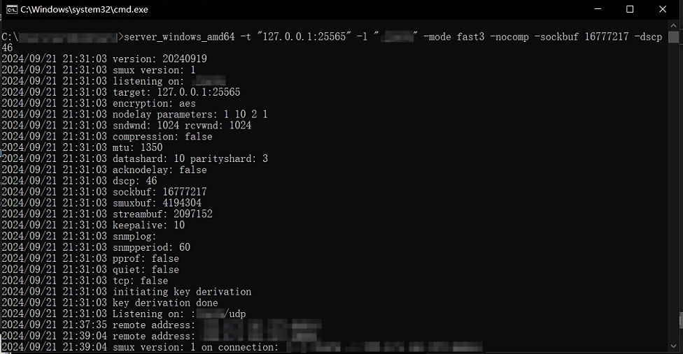
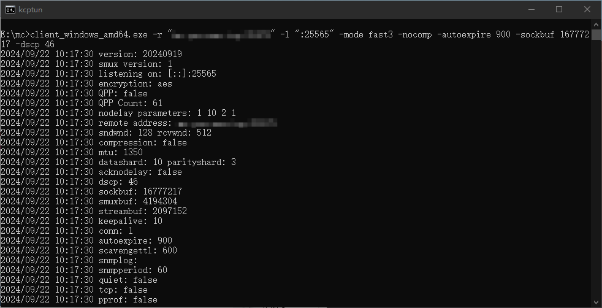
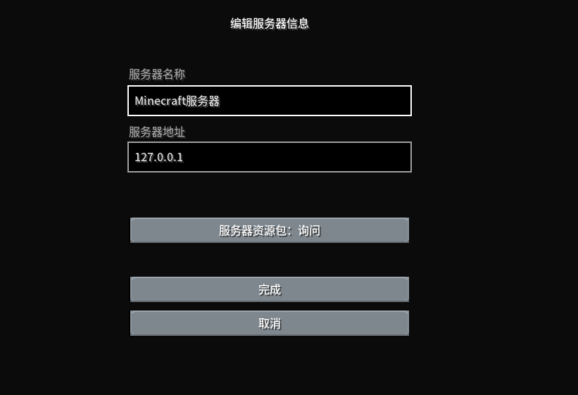

# 使用 kcptun 连接 Minecraft Server

## 起因

本人就读于教令院丢包大学，每到晚高峰期从 Teamspeak 客户端连接信息可以看到传入的丢包率为 0.5%~20%浮动。此时连接 Minecraft 服务器，会出现以下两种情况：

* 长时间等待后报错“连接超时”
* 进入服务器后不加载地图，极速下坠，然后退出服务器报错“connection reset”

突然想到在知乎看过一篇关于 kcp 的文章，这个协议可以缓解这种症状。经过一番查找找到[kcptun](https://github.com/xtaci/kcptun)项目。

## 此方法的优缺点

优点：

* 不用修改客户端与添加模组
* 配置方便
* 相比裸连能某些游戏内操作能更流畅（如使用工作台与睡觉）

缺点：

* 需要服务端与客户端额外安装软件
* 需要服务端额外开放端口
* 游玩很长一段时间后会毫无预兆的突然断开服务器，原因未知

## 解决步骤

0. 确保你已经配置好了 Minecraft Server
1. 去[这里](https://github.com/xtaci/kcptun/releases/latest)下载适合你的环境的 release
2. 解压。将 server 开头二进制文件的上传服务器，client 开头的留在客户端。
3. 服务端运行此命令（注意前面的应用名应与你下载的 release 一致）

```bash
./server_windows_amd64 -t "127.0.0.1:25565" -l ":11451" -mode fast3 -nocomp -sockbuf 16777217 -dscp 46
```



4. 防火墙/路由器 放行 11451 端口

5. 客户端运行此命令（注意前面的应用名应与你下载的 release 一致，将[server-host]替换为你所要连接的服务器 ip 或域名）

```bash
./client_windows_amd64.exe -r "[server-host]:11451" -l ":25565" -mode fast3 -nocomp -autoexpire 900 -sockbuf 16777217 -dscp 46
```



6. 可以将以上命令制作为脚本，方便重复使用

7. 在 Minecraft 客户端的 直接连接\添加服务器 中的服务器地址填入

```bash
127.0.0.1
```


